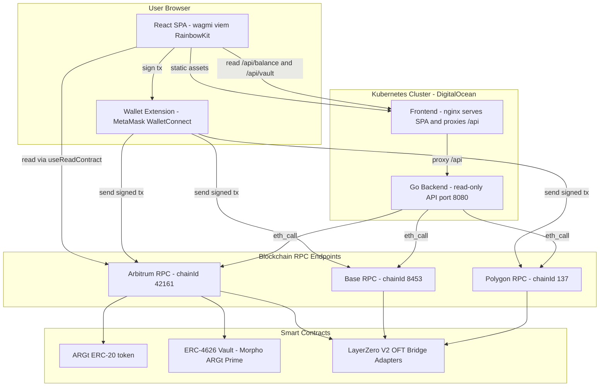

# Architecture — Twin Neobank (ARGt Wallet)

## Overview

**Twin Neobank** is a **non-custodial** web wallet for Twin's **ARGt** stablecoin
(an ERC-20, 18 decimals, native to Arbitrum). It was built for the *Twin your
Neobank* hackathon (LATAM Digital Assets Conference) and implements three
milestones: viewing balances and transferring ARGt, depositing into a Morpho
ERC-4626 vault, and bridging ARGt across chains via a LayerZero V2 OFT adapter.

### Core principle: the backend never holds keys

Every **state-changing transaction** (`transfer`, `approve`, `deposit`,
`redeem`, `send`) is built in the browser and **signed client-side by the
user's own wallet** (MetaMask / WalletConnect). The user is always in custody of
their funds.

The Go backend is **strictly read-only**. It exposes a small HTTP API that
answers balance and vault-position queries by issuing raw `eth_call` requests to
public RPC endpoints. It has no private keys, no database, and no ability to
move funds. Reads are duplicated on the client (via wagmi/viem `useReadContract`)
so the wallet remains fully usable even if the backend is unavailable.

## High-level system architecture

## Component breakdown

### Frontend (React SPA)

- **Stack:** React + Vite + TypeScript, **wagmi/viem** for chain reads and
  writes, **RainbowKit** for wallet connection UI, **TanStack Query** for
  caching read calls.
- **Providers** (`main.tsx`): `WagmiProvider` -> `QueryClientProvider` ->
  `RainbowKitProvider` wrap the app. Supported chains are Arbitrum, Base and
  Polygon (`wagmi.ts`).
- **Responsibilities:** connect the wallet, read balances and vault positions,
  and build/sign every transaction. Contract addresses, chain IDs and LayerZero
  EIDs are hardcoded as the UI's single source of truth in
  `frontend/src/lib/contracts.ts`.
- **Components** (one per feature card):
  - `BalanceCard` — reads ARGt `balanceOf` on Arbitrum.
  - `TransferCard` — ARGt `transfer`.
  - `VaultCard` — ERC-4626 `approve` -> `deposit`, `redeem`, plus position read.
  - `BridgeCard` — OFT `approve` -> `quoteSend` -> `send`.
- **Served by nginx** (`deploy/nginx.conf`): SPA fallback on `/`, and a reverse
  proxy of `/api/` to the in-cluster backend service `twin-neobank-backend:8080`.

### Backend (Go, read-only)

- **Stack:** Go standard library only (`net/http`, `log/slog`). On-chain reads
  use **raw JSON-RPC `eth_call`** — calldata is encoded by hand (4-byte selector
  + 32-byte ABI words) and results decoded as `uint256` (`chain/chain.go`). No
  web3 dependency is required.
- **Configuration** (`config/config.go`): all contract addresses, chain IDs and
  LayerZero EIDs are compiled-in constants. Per-chain RPC URLs are read from the
  environment (`RPC_ARBITRUM`, `RPC_BASE`, `RPC_POLYGON`) with public defaults,
  so secrets are never committed.
- **HTTP API** (`handlers/handlers.go`), all `GET`, CORS-enabled:

  | Endpoint | Purpose |
  |---|---|
  | `/healthz`, `/readyz` | Liveness / readiness probes |
  | `/api/config` | Chain + contract metadata (single source of truth) |
  | `/api/balance?address=&chain=` | ARGt balance (defaults to `arbitrum`) |
  | `/api/vault?address=` | ERC-4626 shares + underlying value via `convertToAssets` |

- **Function selectors used:** `balanceOf(address)` = `70a08231`,
  `convertToAssets(uint256)` = `07a2d13a`.

## Tech stack

| Layer | Technology |
|---|---|
| Frontend | React, Vite, TypeScript, wagmi/viem, RainbowKit, TanStack Query |
| Backend | Go (stdlib `net/http`, `log/slog`), raw JSON-RPC `eth_call` |
| Containers | Docker multi-stage; distroless (backend), nginx 1.27 (frontend) |
| Orchestration | Kubernetes via Kustomize (base + `prod` overlay) |
| Infrastructure | Terraform -> DigitalOcean (DOKS cluster, DOCR registry) |
| Remote state | DigitalOcean Spaces (S3-compatible backend) |
| CI/CD | GitHub Actions (app CI/CD, infra plan/apply) |
| Chains | Arbitrum (42161), Base (8453), Polygon (137) |

## Milestones and contracts

The three milestones map to concrete contracts. Addresses, chain IDs and
LayerZero EIDs below are taken from `docs/challenge.md`,
`backend/internal/config/config.go` and `frontend/src/lib/contracts.ts`.

### M1 — Balance and transfers (ARGt, Arbitrum)

- **ARGt ERC-20 (18 decimals):** `0x59863989d080B22476DB95656d0C3CC18be92214`
- Chain: Arbitrum, chain ID **42161**.
- Reads: `balanceOf`. Writes: `transfer`.

### M2 — Morpho ERC-4626 vault (Arbitrum)

- **Vault "ARGt Prime":** `0x9Dd3F844747AB78d616BF76DB92756E17A064aDD`
- Underlying asset: ARGt (address above). Chain: Arbitrum (42161).
- Reads: `balanceOf` (shares), `convertToAssets`. Writes: `approve` (on ARGt),
  `deposit`, `redeem`.

### M3 — LayerZero V2 OFT bridge

One OFT adapter per chain. `lzEid` is used as `dstEid` when bridging **to** that
chain. Ethereum is **not** supported.

| Chain | Chain ID | LayerZero EID | Adapter |
|---|---|---|---|
| Arbitrum | 42161 | 30110 | `0x4821FBf47B261F0D52Ba0F941CF67b8648f82691` |
| Base | 8453 | 30184 | `0xe80Af1d12426dB4394b147e04f179a38e7C5Dfe7` |
| Polygon | 137 | 30109 | `0xD70ad085684b2A9f4B5d54D7BDB2ecA37a273216` |

- Writes: `approve` (ARGt -> source adapter), `send` (payable). Read: `quoteSend`
  for the native messaging fee.

See [`flows.md`](./flows.md) for the step-by-step transaction flows and
[`deployment.md`](./deployment.md) for infrastructure and CI/CD.
