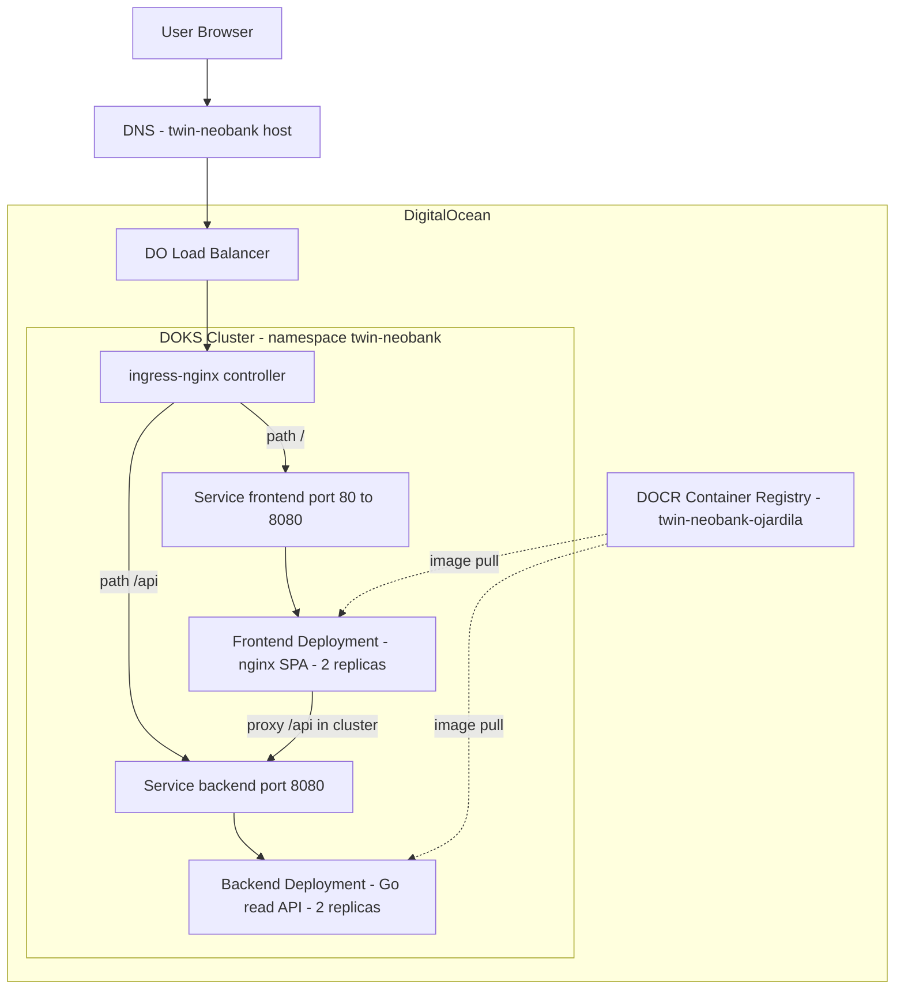
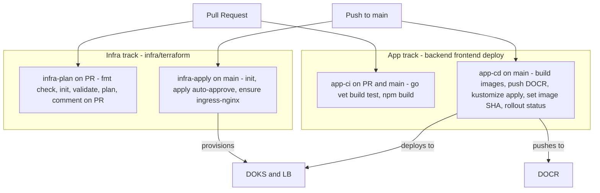

# Deployment — Infrastructure and CI/CD

The wallet runs on **DigitalOcean Kubernetes (DOKS)**, with images in the
**DigitalOcean Container Registry (DOCR)**. Infrastructure is provisioned with
**Terraform** (remote state in **DigitalOcean Spaces**), and application and
infrastructure changes are driven by **GitHub Actions**.

## Deployment topology

Traffic enters through a DigitalOcean Load Balancer fronting the `ingress-nginx`
controller, which routes by path: `/api` to the Go backend service, everything
else to the nginx-served SPA. Both deployments run 2 replicas and listen on
container port **8080**. Pods pull private images from DOCR using a pull secret
attached to the namespace's default service account.

Note: the SPA's nginx also proxies `/api` to the backend service in-cluster
(`deploy/nginx.conf`), so browser API calls can reach the backend whether they
arrive via the ingress `/api` rule or same-origin through the frontend.

## CI/CD pipelines

Four GitHub Actions workflows split cleanly into **infra** and **app** tracks,
each with a PR (validate/plan) stage and a `main` (apply/deploy) stage.

### Infra — `infra-plan` (on PR)

Runs on pull requests touching `infra/terraform/**`. Steps: `terraform fmt
-check`, `init`, `validate`, `plan`, then posts the plan output as a PR comment.
Uses DO Spaces credentials (`AWS_ACCESS_KEY_ID` / `AWS_SECRET_ACCESS_KEY` from
GitHub secrets) for the S3 backend and `TF_VAR_do_token` for the provider.

### Infra — `infra-apply` (on `main`)

Runs on pushes to `main` touching `infra/terraform/**`, serialized via a
concurrency group so two applies never race on state. Steps: `terraform init`,
`terraform apply -auto-approve`, then `doctl kubernetes cluster kubeconfig save`
and an idempotent `kubectl apply` of **ingress-nginx** (which provisions the DO
Load Balancer).

### App — `app-ci` (on PR and `main`)

Runs on changes to `backend/**`, `frontend/**`, `deploy/**`. Two jobs:
- **backend:** `go vet ./...`, `go build ./...`, `go test ./...` (Go 1.22).
- **frontend:** `npm install`, `npm run build` (Node 20).

### App — `app-cd` (on `main`)

Runs on pushes to `main`. Steps:
1. `doctl registry login` to DOCR.
2. Build and push the **backend** and **frontend** images, tagged both `latest`
   and the commit `SHA`, with GitHub Actions layer caching.
3. `doctl kubernetes cluster kubeconfig save`.
4. `kubectl apply -k deploy/k8s/overlays/prod` (Kustomize), then
   `kubectl set image ...:<SHA>` to pin the exact build, then
   `kubectl rollout status` on both deployments.

## Terraform-managed resources

Defined in `infra/terraform/main.tf`:

| Resource | Purpose |
|---|---|
| `digitalocean_kubernetes_cluster.twin` | DOKS cluster with one `worker` node pool (default 2 x `s-2vcpu-2gb`, auto-upgrade) |
| `digitalocean_container_registry.twin` | DOCR registry `twin-neobank-ojardila` (tier `basic`) |
| `digitalocean_container_registry_docker_credentials.twin` | dockerconfigjson credentials for image pulls |
| `kubernetes_namespace.twin` | `twin-neobank` namespace |
| `kubernetes_secret.docr_pull` | DOCR pull secret in the namespace |
| `kubernetes_default_service_account.twin` | Attaches the pull secret to the default SA so pods pull private images without per-deployment `imagePullSecrets` |

**Remote state backend:** DigitalOcean Spaces (S3-compatible), bucket
`twin-neobank-tfstate-ojardila`, key `prod/terraform.tfstate`, endpoint
`https://nyc3.digitaloceanspaces.com` (`infra/terraform/versions.tf`).

The Kustomize `prod` overlay (`deploy/k8s/overlays/prod/kustomization.yaml`) maps
the neutral image names to
`registry.digitalocean.com/twin-neobank-ojardila/twin-neobank-{backend,frontend}`
and targets the `twin-neobank` namespace created by Terraform.

## How to deploy

1. **Provision infrastructure.** From `infra/terraform`, set `TF_VAR_do_token`
   and run `terraform init && terraform apply`. This creates the DOKS cluster,
   DOCR registry, namespace and pull secret. Then
   `doctl kubernetes cluster kubeconfig save twin-neobank`.
2. **Install the ingress controller** (once per cluster) with
   `kubectl apply -f https://raw.githubusercontent.com/kubernetes/ingress-nginx/main/deploy/static/provider/do/deploy.yaml`.
   This provisions the DO Load Balancer. (The `infra-apply` workflow also does
   this idempotently.)
3. **Deploy the app** by pushing to `main`: `app-cd` builds and pushes images to
   DOCR and runs `kubectl apply -k deploy/k8s/overlays/prod` with a SHA-pinned
   rollout. To deploy manually: `kubectl apply -k deploy/k8s/overlays/prod`.
4. **Point DNS** for the ingress host (`twin-neobank.example.com` in
   `deploy/k8s/base/ingress.yaml`) at the Load Balancer IP from
   `kubectl -n ingress-nginx get svc ingress-nginx-controller`.

### Local testing

`docker compose up --build` runs the full stack locally: frontend on
`http://localhost:3000` (nginx on container port 8080), backend API on
`http://localhost:8080`.
