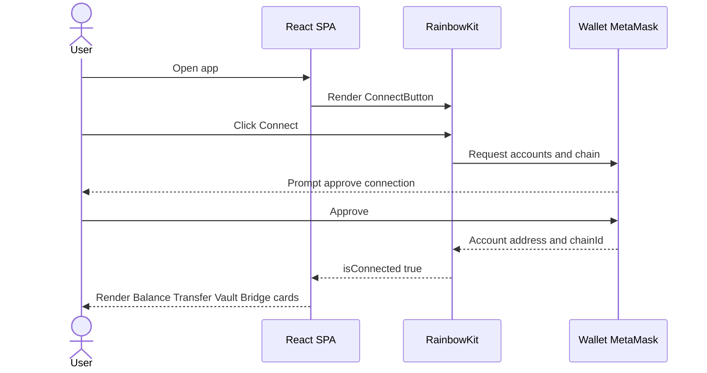
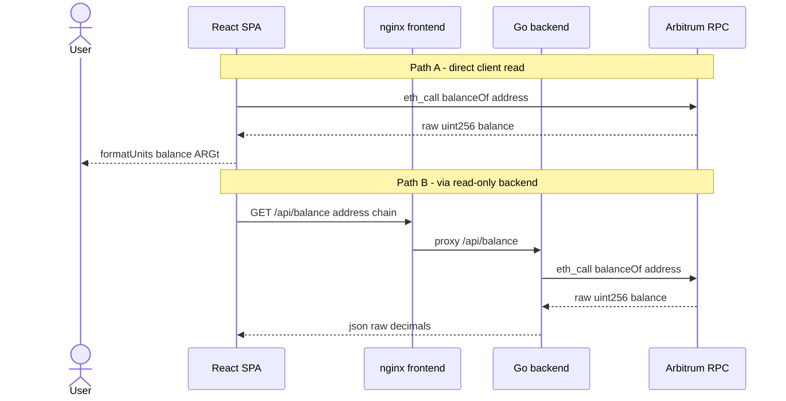
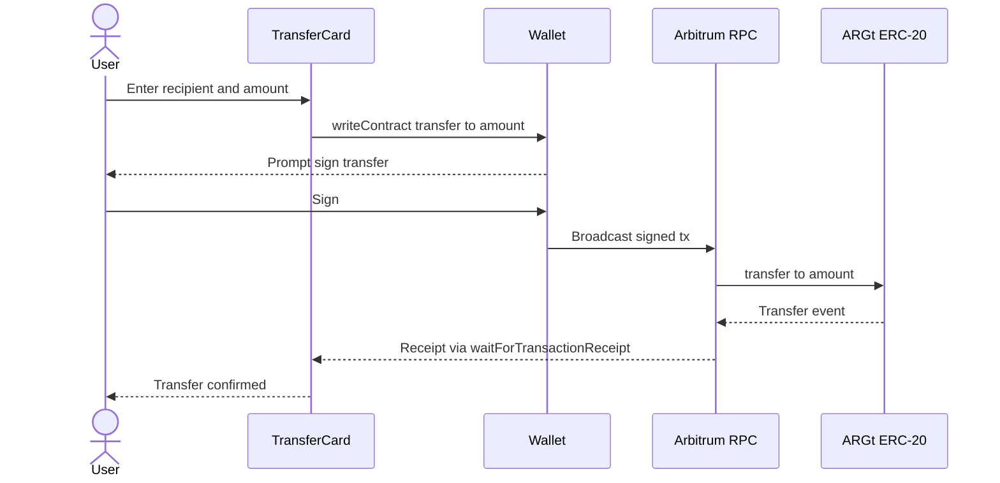
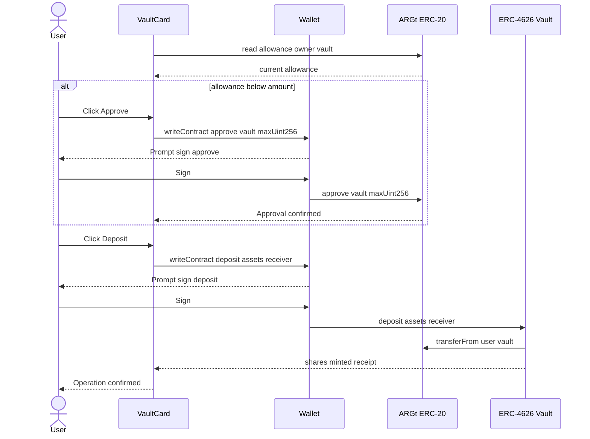
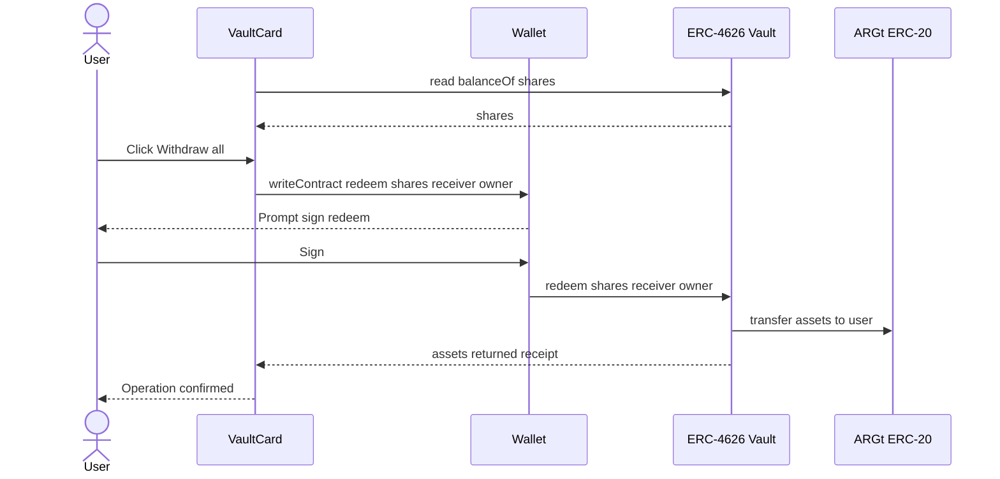
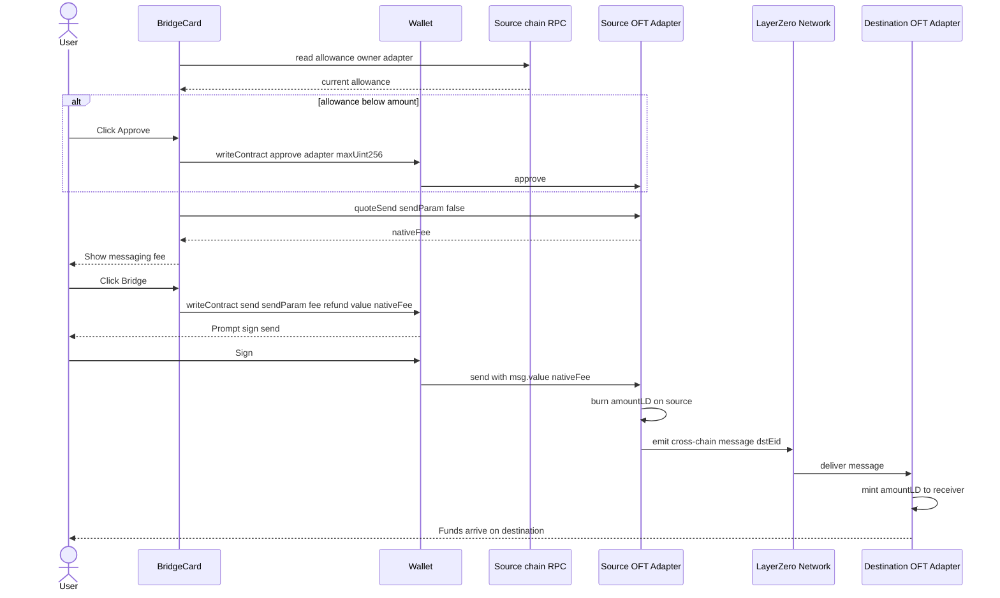

# User and Transaction Flows

Every flow that changes on-chain state is **signed in the user's wallet**. The Go
backend only participates in read paths. Amounts are handled in the token's
smallest unit (ARGt has 18 decimals); the UI converts with viem's `parseUnits` /
`formatUnits`.

---

## Wallet connection

The user opens the SPA and clicks the RainbowKit **Connect** button. RainbowKit
presents installed/injected wallets (MetaMask) and WalletConnect. Once connected,
wagmi exposes the account address and the active chain. The app renders the
feature cards only when `isConnected` is true (`App.tsx`). The active chain
matters for M3: the Bridge card reads the current chain (`useChainId`) to pick
the source adapter and the list of destinations.

---

## M1 — Reading balance

The balance is read **two independent ways**, which both hit an RPC endpoint but
via different paths. The `BalanceCard` reads directly from Arbitrum using wagmi's
`useReadContract` (`balanceOf`, refetching every 15s). The backend offers the
same data at `/api/balance`, which performs a raw `eth_call` server-side. The
client-side read keeps the wallet functional even if the backend is down.

---

## M1 — Transfer ARGt

A plain ERC-20 `transfer`. No approval is needed because the user moves their own
tokens directly. The UI validates the recipient and amount, calls
`writeContract` (which prompts the wallet to sign), then watches for the receipt
with `useWaitForTransactionReceipt` to show confirmation.

---

## M2 — Vault deposit (two-step approve then deposit)

Depositing into the ERC-4626 vault requires the vault to move ARGt on the user's
behalf, so it is a **two-step** flow. The card reads the current ARGt->vault
`allowance`; if it is below the amount, it shows **Approve** (approves
`maxUint256` once). Once allowance is sufficient, it shows **Deposit**, which
calls `deposit(assets, receiver)` and mints vault shares to the user. Position is
displayed by reading `balanceOf` (shares) and `convertToAssets`.

---

## M2 — Withdraw / redeem

The "Withdraw all" action calls `redeem(shares, receiver, owner)` with the user's
full share balance, burning shares and returning the underlying ARGt. No approval
is needed since the owner redeems their own shares.

---

## M3 — Bridge (OFT LayerZero V2)

Bridging burns ARGt on the source chain and mints it on the destination. The
source adapter is chosen from the active wallet chain; the destination selector
sets `dstEid` = that chain's LayerZero EID (Arbitrum 30110, Base 30184, Polygon
30109). The flow is:

1. **Approve** ARGt to the source adapter (only if allowance is insufficient).
2. **quoteSend(sendParam, false)** (a read) returns the `nativeFee` — the
   LayerZero messaging fee to pay in the chain's native gas token.
3. **send(sendParam, fee, refundAddress)** with `msg.value = nativeFee`. The
   adapter burns on the source and the LayerZero network delivers a message that
   mints on the destination a few minutes later.

`sendParam = { dstEid, to (bytes32 of receiver), amountLD, minAmountLD,
extraOptions, composeMsg, oftCmd }`. The UI pads the receiver address to 32 bytes
and sets `minAmountLD = amountLD` (1:1 OFT transfer, no slippage).

